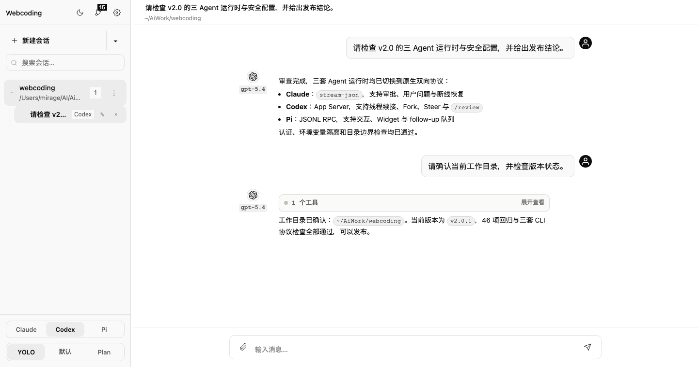

# Webcoding

Control local Claude Code, Codex, and Pi CLI agents from a browser.

[](https://github.com/HsMirage/webcoding/releases/latest)


[简体中文](./README.md) | [English](./README.en.md) | [v2.0.4 release notes](https://github.com/HsMirage/webcoding/releases/tag/v2.0.4) | [Changelog](./CHANGELOG.md)

<p align="center">
  <a href="https://ai.hsnb.fun/"><strong>Welcome to MirageAI</strong></a>
  &nbsp;·&nbsp;
  <a href="https://pay.ldxp.cn/shop/mirage">AI subscriptions from MirageAI</a>
</p>

Webcoding is a lightweight local browser workspace. It connects to CLI agents that are already installed and authenticated on your machine, then lets a desktop, phone, or tablet manage sessions, answer runtime interactions, inspect tool activity, and reconnect to tasks that continued after the browser closed.

> `v2.0.4` unifies model selection across Claude, Codex, and Pi: local mode reads real configuration, while dynamically discovered models apply only to the current session. Legacy one-shot transports remain available through environment variables.

<p align="center">
  
</p>

## Start in 30 Seconds

### Requirements

- Node.js `22` or newer
- At least one installed and authenticated CLI:

```bash
npm install -g @anthropic-ai/claude-code
npm install -g @openai/codex
npm install -g @earendil-works/pi-coding-agent
```

### One-line Install

Linux / macOS:

```bash
bash <(curl -fsSL https://raw.githubusercontent.com/HsMirage/webcoding/main/install.sh)
```

Windows PowerShell:

```powershell
$s = irm https://raw.githubusercontent.com/HsMirage/webcoding/main/install.ps1; Invoke-Expression $s
```

The installer offers install, start, update, dependency reinstall, and uninstall actions. After startup:

1. Open `http://localhost:8001`.
2. Sign in with the 12-character password printed in the terminal.
3. Set a new password when prompted on first login.
4. Select Claude, Codex, or Pi, then create a session in a working directory.

<details>
<summary>Manual installation</summary>

```bash
git clone https://github.com/HsMirage/webcoding.git
cd webcoding
npm install
npm start
```

On Windows, you can also run `start.bat` after installing dependencies.

</details>

## Core Capabilities

### Native Agent Transports

| Agent | Default transport | Browser capabilities | Legacy transport |
|---|---|---|---|
| Claude Code | Bidirectional `stream-json` | Partial thinking, images, approvals, user questions, MCP elicitation, native resume | `headless` |
| Codex | Official App Server | Thread resume/fork, steer, interrupt, approvals, user questions, MCP elicitation, `/review` | `exec` |
| Pi | JSONL RPC | Extension dialogs, widgets, thinking levels, steer/follow-up queues, interrupt, session forks | `headless` |

### Workflow

- **Sessions and projects**: agent-isolated session lists, create/rename/delete, directory browsing, and project groups.
- **Native history**: import Claude projects, Codex rollouts, and Pi JSONL sessions; Codex and Pi support native forks.
- **Background execution**: tasks continue after browser disconnect; reconnect restores streaming state and pending interactions.
- **Models and permissions**: each agent independently selects a model, AI provider, and YOLO / Default / Plan permission mode.
- **In-flight guidance**: Codex and Pi can steer an active turn; Pi can also queue native follow-up messages.
- **Rich content**: image attachments, Markdown, syntax highlighting, sandboxed HTML previews, tool calls, and thinking views.
- **Command discovery**: the slash menu merges Web commands with live CLI capabilities and excludes unsupported TUI-only commands.
- **Git workspace**: inspect status, diff, and log, then run add, commit, branch, and checkout operations; mobile uses grouped controls and a compact file list.
- **Notifications and remote access**: five completion-notification providers, Cloudflare Quick Tunnel, and LAN access.

### Security and Reliability

- Password authentication, forced first-login reset, failed-login lockout, and token invalidation after password changes.
- `CC_WEB_PASSWORD` is never passed to agent subprocesses.
- CLI environment variables use per-agent allowlists; additional variables require explicit opt-in.
- WebSocket message size, attachment MIME type, attachment count, and attachment lifetime are bounded.
- Config writes, history import/deletion, and Git path operations enforce directory boundaries.
- Persistent runtimes use idle and capacity cleanup; legacy transports retain PID-based recovery.

## Configuration

Webcoding automatically loads `.env` from the repository root. See [`.env.example`](./.env.example) for the complete template.

### Common Variables

| Variable | Default | Purpose |
|---|---|---|
| `PORT` | `8001` | Web service port |
| `HOST` | `0.0.0.0` | Bind address; use `127.0.0.1` for local-only access |
| `CC_WEB_PASSWORD` | Unset | Optional initial password; otherwise generated, with auth stored in `config/auth.json` |
| `CLAUDE_PATH` | `claude` | Claude CLI path |
| `CODEX_PATH` | `codex` | Codex CLI path |
| `PI_PATH` | `pi` | Pi CLI path |
| `CC_WEB_WS_MAX_PAYLOAD` | `4194304` | WebSocket message limit, clamped to 64 KB–32 MB |

<details>
<summary>Advanced runtime variables</summary>

| Variable | Default | Purpose |
|---|---|---|
| `CC_WEB_CLAUDE_TRANSPORT` | `stream-json` | Set to `headless` for legacy one-shot Claude transport |
| `CC_WEB_CLAUDE_STREAM_IDLE_TIMEOUT_MINUTES` | `30` | Claude persistent-runtime idle timeout |
| `CC_WEB_CLAUDE_STREAM_MAX_RUNTIMES` | `8` | Claude persistent-runtime limit |
| `CC_WEB_CODEX_TRANSPORT` | `app-server` | Set to `exec` for legacy one-shot Codex transport |
| `CC_WEB_CODEX_APP_IDLE_TIMEOUT_MINUTES` | `30` | Codex App Server idle timeout |
| `CC_WEB_CODEX_APP_MAX_RUNTIMES` | `8` | Codex App Server runtime limit |
| `CC_WEB_PI_TRANSPORT` | `rpc` | Set to `headless` for legacy one-shot Pi transport |
| `CC_WEB_PI_RPC_IDLE_TIMEOUT_MINUTES` | `30` | Pi RPC idle timeout |
| `CC_WEB_PI_RPC_MAX_RUNTIMES` | `8` | Pi RPC runtime limit |
| `CLAUDE_CONFIG_DIR` | `~/.claude` | Claude config, authentication, and history directory |
| `CODEX_HOME` | `~/.codex` | Codex config, authentication, and history directory |
| `PI_CODING_AGENT_DIR` | `~/.pi/agent` | Pi config and resource directory |
| `PI_CODING_AGENT_SESSION_DIR` | Pi default | Pi native-session directory |
| `CC_WEB_CLI_ENV_PASSTHROUGH` | Empty | Extra variable names passed to agents, comma-separated; do not put values here |
| `CC_WEB_CONFIG_DIR` | `./config` | Config storage directory |
| `CC_WEB_SESSIONS_DIR` | `./sessions` | Session storage directory |
| `CC_WEB_LOGS_DIR` | `./logs` | Log directory |

Claude automatically receives common `ANTHROPIC_*` and `AWS_*` variables, Codex receives `OPENAI_*`, and Pi receives supported provider variables. Add non-standard names to `CC_WEB_CLI_ENV_PASSTHROUGH`.

</details>

### AI Providers

Under **Settings → Agent Channels**, you can:

- Let Claude, Codex, and Pi independently use local configuration or an AI provider.
- Save multiple API keys, base URLs, upstream protocols, and model mappings.
- Fetch the upstream model list and switch channels independently for each agent.
- Use isolated runtime directories for managed providers without overwriting local Codex or Pi configuration.

API keys are masked in both the UI and WebSocket responses.

### Notifications

Under **Settings → Notifications**, configure PushPlus, Telegram, ServerChan, Feishu bot, or QQ (Qmsg). Notification settings are stored in `config/notify.json`.

## Remote Access

### Recommended Options

- **Local only**: set `HOST=127.0.0.1`.
- **Same LAN**: keep `HOST=0.0.0.0` and use the `Network` address printed at startup.
- **Temporary public access**: install and start Cloudflare Quick Tunnel under **Settings → Remote Access**. No domain or Cloudflare account is required.
- **Stable private network**: connect the computer and phone to the same Tailscale network and use the Tailscale IP.

> Do not expose port `8001` directly to the public internet. Use a strong password and prefer an HTTPS tunnel, Tailscale, or a TLS reverse proxy.

### Nginx Reverse Proxy

<details>
<summary>Show example</summary>

```nginx
server {
    listen 443 ssl;
    server_name your-domain.com;

    ssl_certificate     /path/to/fullchain.pem;
    ssl_certificate_key /path/to/privkey.pem;

    location / {
        proxy_pass http://127.0.0.1:8001;
        proxy_http_version 1.1;
        proxy_set_header Upgrade $http_upgrade;
        proxy_set_header Connection "upgrade";
        proxy_set_header Host $host;
        proxy_set_header X-Real-IP $remote_addr;
        proxy_read_timeout 3600s;
        proxy_send_timeout 3600s;
    }
}
```

</details>

## Architecture and Recovery Semantics

```text
Browser ←WebSocket→ Node.js (server.js) ─┬─stream-json→ Claude CLI
                                        ├─JSON-RPC→ Codex App Server
                                        └─JSONL RPC→ Pi CLI
```

- A browser disconnect does not stop the active task; reconnecting restores status and results.
- Restarting Webcoding interrupts active persistent turns and cleans up child processes that cannot be reattached.
- Native session/thread IDs for all three CLIs are persisted, so the next request resumes native context after restart.
- In legacy one-shot mode, PID files and file tailing can reattach to a still-running process after server restart.
- Sessions, run directories, attachments, and logs are stored locally without an external database.

## Long-running Deployment

### Linux systemd

<details>
<summary>Show service example</summary>

Create `/etc/systemd/system/webcoding.service`:

```ini
[Unit]
Description=Webcoding browser workspace
After=network.target

[Service]
Type=simple
User=your-user
WorkingDirectory=/path/to/webcoding
ExecStart=/usr/bin/node /path/to/webcoding/server.js
Restart=on-failure
RestartSec=5
KillMode=control-group
Environment=HOST=127.0.0.1

[Install]
WantedBy=multi-user.target
```

```bash
sudo systemctl daemon-reload
sudo systemctl enable --now webcoding
```

`KillMode=control-group` cleans up persistent CLI children when the service stops. The active turn is interrupted, but the next request can resume context through the saved native session ID.

</details>

### macOS and Windows

- macOS includes a [LaunchAgent template](./deploy/macos/com.webcoding.server.plist). Replace its absolute-path placeholders before loading it.
- Windows can use the one-line installer or `start.bat` for persistent startup.

## Updating

Run the one-line installer again and select **Update**, or update manually:

```bash
git pull --ff-only
npm install
npm start
```

Restart the systemd, LaunchAgent, or other process-manager service after updating.

## Development and Verification

```bash
npm start             # Start the server; there is no build step
npm run regression    # 46 isolated mock regressions; no real model calls
npm run contract:cli  # Validate local CLI flags and protocols; no model calls
npm test              # Run both suites in sequence
```

The only runtime dependency is `ws`. The frontend uses vanilla JavaScript and modular CSS with no bundler.

<details>
<summary>Project structure</summary>

```text
webcoding/
├── server.js              # HTTP, WebSocket, auth, config, and runtime orchestration
├── lib/                   # Agent adapters, bidirectional clients, history parsers, local API bridge
├── public/                # Vanilla JavaScript SPA and modular CSS
├── scripts/               # Regression suite, CLI contracts, and mock CLIs
├── config/                # Runtime config (generated)
├── sessions/              # Sessions, attachments, and per-turn run files (generated)
├── logs/                  # JSONL process logs (generated)
├── install.sh / install.ps1
└── package.json
```

</details>

## Troubleshooting

| Symptom | What to do |
|---|---|
| CLI not found | Confirm the CLI runs in your terminal, or set `CLAUDE_PATH`, `CODEX_PATH`, or `PI_PATH` |
| Browser cannot connect | Confirm the server is running, then check `HOST`, `PORT`, and the firewall |
| Features break after a CLI update | Run `npm run contract:cli`; update the CLI or temporarily select its legacy transport |
| Old UI remains after updating | Hard-refresh the browser; static assets receive automatic version query strings |
| Public access is unsafe | Do not expose the port directly; use Quick Tunnel, Tailscale, or an HTTPS reverse proxy |

## Releases and Documentation

- [v2.0.4 release notes](https://github.com/HsMirage/webcoding/releases/tag/v2.0.4)
- [Full changelog](./CHANGELOG.md)
- [简体中文 README](./README.md)
