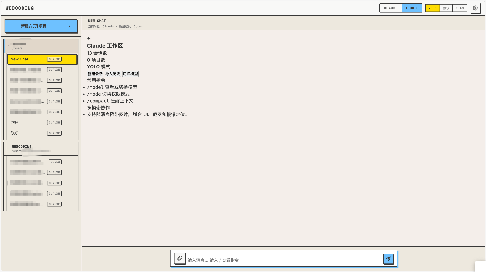
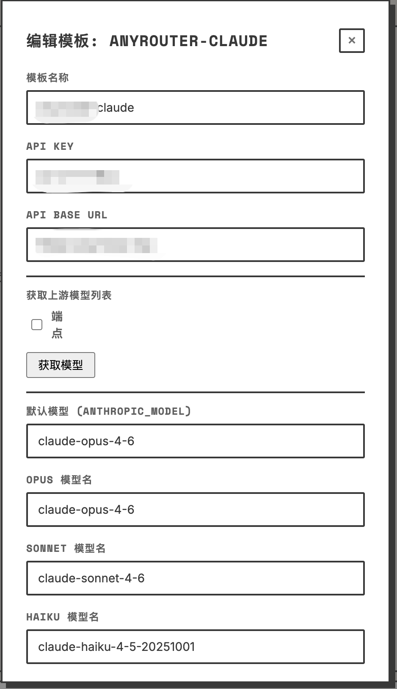
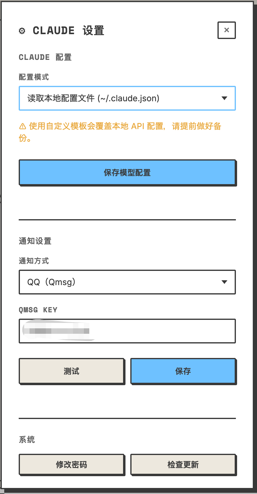

# Webcoding

---

<p align="center"><strong>⭐ <a href="https://ai.hsnb.fun/aiplanhub">AIPlanHub</a> — 一站式对比国内主流 AI 订阅方案，覆盖编程 · 视频 · 音频多场景，帮你找到性价比最高的选择 ⭐</strong></p>

---

Webcoding 是一个面向 Claude Code / Codex / Pi 的轻量级浏览器工作台，用来在网页里远程接入本机 CLI Agent。


[English README](./README.en.md) | [更新日志](./CHANGELOG.md)

当前仓库名、界面品牌与文档示例均以 `Webcoding` 为准。

<p align="center">
  
</p>

<p align="center">
  
  
</p>


## 功能特性

- **超轻量** — 后端性能占用少，前端通过 web 访问
- **多 Agent 会话** — 新建会话时可选择 Claude、Codex 或 Pi，沿用相同的 Web 会话与后台任务模型
- **Agent 视图隔离** — 侧边栏切换 Claude / Codex / Pi 后，仅展示当前 Agent 的会话与最近记录，互不干扰
- **独立 Agent 设置** — 各 Agent 拥有独立的模型、提供商、权限模式与运行时适配，保持贴近各自原生 CLI 的使用方式
- **原生推理强度** — `/effort` 统一控制 Claude/Codex 的 effort 与 Pi thinking level；选项来自当前 CLI/模型能力，Pi 同时保留 `/thinking`
- **Claude 常驻流协议** — 同一 Web 会话复用双向 `stream-json` 进程，支持增量 thinking、hook 事件、图片输入、原生会话续接、网页审批、用户问题和 MCP elicitation
- **Codex App Server** — 使用官方双向协议，支持线程创建/恢复/Fork、运行中转向、原生中断、网页审批、用户问题和 MCP elicitation
- **Pi 双向 RPC** — 持久连接 Pi 会话，支持扩展选择/确认/输入、状态与 Widget、输入框预填，生成中“转向 / 接着做”、原生中断、模型与 thinking level 发现和命令发现
- **多会话管理** — 创建、切换、重命名、删除会话，并按 Agent 清理对应的原生线程或 Web 托管会话存储
- **原生会话续接** — Claude、Codex、Pi 分别保存自己的原生会话编号，Web 服务重启后下一轮仍可恢复上下文
- **本地历史导入** — 支持 Claude `projects/`、Codex rollout 和 Pi JSONL 历史；Pi 会按活动分支恢复思考、工具、token 与费用
- **原生会话分支** — Codex `/fork` 复制当前线程；Pi `/fork` 可搜索并选择历史用户消息，将原提示回填为可编辑草稿
- **后台任务** — 关闭浏览器后当前 Agent 仍继续运行，完成后推送通知；重新打开可恢复流式状态和待回应交互
- **多渠道通知** — 支持 PushPlus / Telegram / Server酱 / 飞书机器人 / QQ（Qmsg），Web UI 内可视化配置
- **运行时复用** — 三套 CLI 均优先使用各自的持续双向协议，并按空闲时间和容量自动回收
- **多 API 切换** — 可配置多个 API 方案，UI 中一键切换，即时生效
- **本地 API 桥接** — 内置 OpenAI 兼容端点，将本地 Claude CLI 转为可供其他工具调用的 API，支持流式响应（`/v1/responses`）
- **图片附件** — 每条消息最多 4 张图片（PNG/JPG/WebP/GIF，单张 ≤ 10 MB），7 天后自动清理
- **斜杠命令** — 合并 Web 平台命令与 CLI 动态发现结果，不会把仅 TUI 可用的命令伪装成可执行
- **Codex 原生审查** — `/review` 通过 App Server `review/start` 在当前线程内执行，不会错误切换会话
- **工作目录管理** — 顶栏实时显示当前会话 cwd，新建会话时可浏览目录选择起始路径
- **HTML 代码预览** — 消息中的 HTML 代码块可在沙箱 iframe 中实时预览
- **plan 模式打断** — plan 权限模式运行期间仍可发送新消息打断当前生成
- **移动端适配** — 响应式布局 + PWA meta，手机访问时顶栏独立显示 Agent / 权限模式选择器
- **密码认证** — 自动生成初始密码、首次登录强制改密、Web UI 修改密码
- **远程访问** — 内置 Cloudflare Tunnel 集成，设置面板一键安装 `cloudflared` 并开启公网 HTTPS 访问，自动显示二维码，无需域名和账号
- **隔离式回归脚本** — `npm run regression` 在临时目录中使用 mock Claude / Codex / Pi CLI 校验主路径，不污染真实数据
- **真实 CLI 契约检查** — `npm run contract:cli` 校验本机 Claude 参数、Codex App Server Schema 与 Pi RPC，及时发现升级不兼容

## 前提条件

- **Node.js** >= 22
- **Claude Code CLI**、**Codex CLI** 或 **Pi CLI**（`@earendil-works/pi-coding-agent`）至少安装并配置其一
  ```bash
  npm install -g @anthropic-ai/claude-code
  npm install -g @openai/codex
  npm install -g @earendil-works/pi-coding-agent
  ```

## 快速开始

### 一键安装（推荐）

**Linux / macOS**
```bash
bash <(curl -fsSL https://raw.githubusercontent.com/HsMirage/webcoding/main/install.sh)
```

**Windows（PowerShell）**
```powershell
$s = irm https://raw.githubusercontent.com/HsMirage/webcoding/main/install.ps1; Invoke-Expression $s
```

运行后会显示交互菜单，选择所需操作（安装 / 启动 / 更新 / 卸载等），访问 `http://localhost:8001` 输入密码即可使用。

> **首次登录密码**：首次启动时会自动生成一个 12 位随机密码并打印在控制台，登录后需立即修改。

### 一键部署：让 Claude 自动完成安装

在 Claude Code 中直接粘贴：
```bash
https://github.com/HsMirage/webcoding 给我装！
```

> 指定安装目录：
> - Linux/macOS: `bash <(curl -fsSL ...) ~/mydir`
> - Windows: `$env:WEBCODING_DIR="C:\mydir"; $s = irm ...; iex $s`

### 手动安装

**Linux / macOS**
```bash
git clone https://github.com/HsMirage/webcoding.git
cd webcoding
npm install
npm start
```

**Windows**
```cmd
git clone https://github.com/HsMirage/webcoding.git
cd webcoding
npm install
```
然后双击 `start.bat`，或在终端运行 `node server.js`。

---

启动后访问 `http://localhost:8001`，输入密码即可使用。

## 配置

### 环境变量 (.env)

| 变量 | 必填 | 默认值 | 说明 |
|------|:---:|--------|------|
| `CC_WEB_PASSWORD` | 否 | 自动生成 | Web 登录密码（首次启动自动迁移到 `config/auth.json`） |
| `PORT` | 否 | `8001` | 服务监听端口 |
| `HOST` | 否 | `0.0.0.0` | 服务监听地址；仅本机使用时建议设为 `127.0.0.1` |
| `CLAUDE_PATH` | 否 | `claude` | Claude CLI 可执行文件路径 |
| `CODEX_PATH` | 否 | `codex` | Codex CLI 可执行文件路径 |
| `PI_PATH` | 否 | `pi` | Pi CLI 可执行文件路径（`@earendil-works/pi-coding-agent`） |
| `CC_WEB_CLAUDE_TRANSPORT` | 否 | `stream-json` | Claude 传输方式；设为 `headless` 可回退到单轮进程模式 |
| `CC_WEB_CLAUDE_STREAM_IDLE_TIMEOUT_MINUTES` | 否 | `30` | Claude 常驻进程空闲释放时间，范围 1–1440 分钟 |
| `CC_WEB_CLAUDE_STREAM_MAX_RUNTIMES` | 否 | `8` | Claude 常驻运行时最大数量，范围 1–64 |
| `CC_WEB_CODEX_TRANSPORT` | 否 | `app-server` | Codex 传输方式；设为 `exec` 可回退到旧的单轮 exec 模式 |
| `CC_WEB_CODEX_APP_IDLE_TIMEOUT_MINUTES` | 否 | `30` | Codex App Server 空闲释放时间，范围 1–1440 分钟 |
| `CC_WEB_CODEX_APP_MAX_RUNTIMES` | 否 | `8` | Codex App Server 最大运行时数量，范围 1–64 |
| `CC_WEB_PI_TRANSPORT` | 否 | `rpc` | Pi 传输方式；设为 `headless` 可回退到原来的单轮 JSON 模式 |
| `CC_WEB_PI_RPC_IDLE_TIMEOUT_MINUTES` | 否 | `30` | Pi RPC 空闲进程自动释放时间，范围 1–1440 分钟 |
| `CC_WEB_PI_RPC_MAX_RUNTIMES` | 否 | `8` | Pi RPC 最大并发运行时数量，范围 1–64 |
| `CLAUDE_CONFIG_DIR` | 否 | `~/.claude` | Claude 配置、鉴权和历史目录；会传给 Claude 子进程 |
| `CODEX_HOME` | 否 | `~/.codex` | Codex 配置、鉴权和历史目录；会传给 Codex 子进程 |
| `PI_CODING_AGENT_DIR` | 否 | `~/.pi/agent` | Pi 配置、资源和原生历史目录 |
| `PI_CODING_AGENT_SESSION_DIR` | 否 | `PI_CODING_AGENT_DIR/sessions` | Pi 原生会话目录；优先级高于 `PI_CODING_AGENT_DIR` |
| `CC_WEB_CLI_ENV_PASSTHROUGH` | 否 | - | 额外传给 Agent 的环境变量名，多个名称用逗号分隔，如 `GH_TOKEN,MY_PROVIDER_KEY` |
| `CC_WEB_WS_MAX_PAYLOAD` | 否 | `4194304` | 单条 WebSocket 消息大小上限，单位为字节，可配置范围 64 KB–32 MB |
| `CC_WEB_CONFIG_DIR` | 否 | `./config` | 配置目录覆写（主要供隔离测试使用） |
| `CC_WEB_SESSIONS_DIR` | 否 | `./sessions` | 会话目录覆写（主要供隔离测试使用） |
| `CC_WEB_LOGS_DIR` | 否 | `./logs` | 日志目录覆写（主要供隔离测试使用） |
| `PUSHPLUS_TOKEN` | 否 | - | PushPlus Token（首次启动自动迁移到通知配置） |

说明：环境变量前缀仍保留为 `CC_WEB_*`，这是为了兼容旧版本配置，不影响现在的项目名 `Webcoding`。

Claude 会自动继承 `ANTHROPIC_*`、`AWS_*` 等本地 Provider 配置，Codex 会自动继承 `OPENAI_*`，Pi 会继承其支持的常见 Provider 变量。其他密钥必须通过 `CC_WEB_CLI_ENV_PASSTHROUGH` 显式允许；`CC_WEB_PASSWORD` 始终不会传入 Agent 子进程。

### 通知配置

点击侧边栏底部的 **⚙ 设置按钮**，在 Web UI 中可视化配置推送通知：

| 通知方式 | 所需配置 | 获取方式 |
|---------|---------|---------|
| **PushPlus**（微信推送） | Token | [pushplus.plus](https://www.pushplus.plus/) 注册获取 |
| **Telegram** | Bot Token + Chat ID | [@BotFather](https://t.me/BotFather) 创建机器人 |
| **Server酱** | SendKey | [sct.ftqq.com](https://sct.ftqq.com/) 注册获取 |
| **飞书机器人** | Webhook URL | 飞书群 → 设置 → 群机器人 → 添加自定义机器人 |
| **QQ（Qmsg）** | Qmsg Key | [qmsg.zendee.cn](https://qmsg.zendee.cn/) 登录后获取，需添加接收 QQ 号 |

配置保存在 `config/notify.json`，Token 在 UI 中脱敏显示（仅显示前4后4位）。

### 密码管理

密码存储在 `config/auth.json`，支持自动生成与 Web UI 修改：

- **首次启动**（无 `.env` 密码、无 `auth.json`）：自动生成 12 位随机密码，打印到控制台，首次登录强制修改
- **从 `.env` 迁移**：如已在 `.env` 设置 `CC_WEB_PASSWORD`，启动时自动迁移到 `auth.json`，无需改密
- **Web UI 修改**：设置面板 → 修改密码（需输入当前密码）
- **密码要求**：≥ 8 位，包含大写/小写/数字/特殊字符中的至少 2 种
- **改密后**：所有已登录会话失效，需重新认证

## 项目结构

```
webcoding/
├── server.js              # Node.js 后端（HTTP + WebSocket + 进程管理 + 通知）
├── lib/
│   ├── agent-runtime.js    # Claude / Codex / Pi 运行时适配层
│   ├── claude-stream-client.js # Claude stream-json 双向客户端
│   ├── codex-app-server-client.js # Codex App Server JSON-RPC 客户端
│   ├── pi-sessions.js      # Pi JSONL 历史解析
│   └── codex-rollouts.js   # Codex rollout 历史解析
├── public/
│   ├── index.html          # 页面结构
│   ├── app.js              # 前端逻辑（WebSocket 通信、UI 交互）
│   ├── css/                # 按基础、布局、聊天、面板等职责拆分的样式
│   ├── markdown-viewer.js  # 隔离的 Markdown 文件预览器
│   ├── style.css           # 旧入口兼容说明（主页面不再加载）
│   └── sw.js               # Service Worker（移动端推送通知）
├── config/
│   ├── codex.json          # Codex 独立配置（运行时生成）
│   ├── notify.json         # 通知渠道配置（运行时生成）
│   └── auth.json           # 密码配置（运行时生成）
├── deploy/
│   └── macos/
│       └── com.webcoding.server.plist  # macOS LaunchAgent 模板
├── sessions/               # 对话历史 JSON 文件（运行时生成）
├── logs/                   # 进程生命周期日志（运行时生成）
├── scripts/
│   ├── regression.js       # 隔离式回归脚本
│   ├── cli-contract.js     # 真实 CLI 参数与协议契约检查
│   ├── mock-claude.js      # 回归用 mock Claude CLI
│   ├── mock-pi.js          # 回归用 mock Pi CLI
│   └── mock-codex.js       # 回归用 mock Codex CLI
├── .env.example            # 环境变量模板
├── start.bat               # Windows 一键启动脚本
├── .gitignore
├── package.json
└── README.md
```

## 架构设计

### 进程模型

```
浏览器 ←WebSocket→ Node.js (server.js) ─┬─stream-json→ Claude CLI（常驻）
                                       ├─JSON-RPC→ Codex App Server（常驻）
                                       └─JSONL RPC→ Pi CLI（常驻）
```

- Claude 默认复用双向 `stream-json` 进程；Codex 默认复用官方 App Server。两者都可通过环境变量回退到旧的单轮模式
- Claude 与 Codex 的审批、用户问题和 MCP elicitation 会转成网页表单，并通过各自原生双向协议发回当前会话
- Pi 默认使用持续运行的 `--mode rpc` 进程，同一 Web 会话跨轮复用 stdin/stdout JSONL 通道
- Pi 生成中可把新消息放入原生 `steer` 或 `followUp` 队列；网页按 Pi 实际开始处理的顺序切分气泡并写入历史，重复发送不会重复入队
- Pi RPC 支持扩展 UI 的双向请求和队列断线恢复；点击停止会丢弃尚未执行的原生队列消息。默认空闲 30 分钟后自动释放，最多并发 8 个运行时，可通过环境变量调整
- 服务重启会结束正在生成的常驻轮次，但三套 CLI 的原生会话编号都会保留，并在下一轮重新续接
- 设置 `CC_WEB_PI_TRANSPORT=headless` 可恢复 `pi -p --mode json` 的单轮后台运行方式
- 三套 Agent 的启动参数与事件解析由 `lib/agent-runtime.js` 管理，各双向客户端分别负责协议帧、请求关联与进程生命周期

### 验证

- `npm run regression`：在隔离目录中运行完整 mock 回归，不调用真实模型
- `npm run contract:cli`：检查本机三套真实 CLI 的参数与协议是否仍满足 Webcoding 接入要求，不发送模型请求
- `npm test`：依次执行以上两组检查

### 后台任务流程

1. 用户发送消息 → 复用或启动所选 Agent 的常驻运行时
2. 用户关闭浏览器 → 当前任务继续运行，待回应交互会在重连后恢复
3. Agent 发出原生完成事件 → 服务端持久化结果
4. 发送推送通知（PushPlus/Telegram/...）
5. 用户重新打开 → 自动同步完成的回复

### 进程日志

日志文件 `logs/process.log`（JSONL 格式，自动轮转 2MB），记录完整的进程生命周期：

| 事件 | 说明 |
|------|------|
| `process_spawn` | 进程创建（PID、模式、模型） |
| `process_complete` | 进程完成（退出码、耗时、费用） |
| `ws_connect` / `ws_disconnect` | 客户端连接/断开 |
| `ws_resume_attach` | 客户端重连并挂载到运行中的进程 |
| `recovery_alive` / `recovery_dead` | 兼容单轮模式下服务重启时恢复进程 |
| `heartbeat` | 每 60 秒活跃进程状态快照 |

查看日志：
```bash
tail -f logs/process.log | jq .
```

## 生产部署

### 远程访问

启动后终端会打印所有可用地址：

```
webcoding server listening on 0.0.0.0:8001
  Local:   http://localhost:8001
  Network: http://192.168.1.42:8001
```

**Cloudflare Tunnel（推荐，无需域名）**

设置面板 → 「远程访问 (Cloudflare Tunnel)」：

1. 点「一键安装 cloudflared」— 自动下载约 40 MB 二进制，安装到 `config/cloudflared`
2. 点「开启 Tunnel」— 约 30 秒后出现公网 HTTPS 地址和二维码
3. 手机扫码或复制链接即可远程访问

> Tunnel 使用 Cloudflare 的 [Quick Tunnels](https://developers.cloudflare.com/cloudflare-one/connections/connect-networks/do-more-with-tunnels/trycloudflare/) 服务，免费、无需账号，每次启动获得一个随机域名。

**Tailscale（跨设备组网）**

电脑和手机各安装 [Tailscale](https://tailscale.com/)，登录同一账号后直接用 Tailscale IP 访问，免费够用。


创建 `/etc/systemd/system/webcoding.service`：

```ini
[Unit]
Description=Webcoding - Claude Code / Codex Web Workspace
After=network.target

[Service]
Type=simple
User=your-user
WorkingDirectory=/path/to/webcoding
ExecStart=/usr/bin/node server.js
Restart=on-failure
RestartSec=5
# 重要：只杀 Node.js 进程，不杀 Claude 子进程
KillMode=process

[Install]
WantedBy=multi-user.target
```

> **`KillMode=process` 非常重要**：确保 systemd 重启服务时只杀 Node.js 进程，Claude 子进程继续运行，服务恢复后自动重新挂载。

```bash
sudo systemctl enable webcoding
sudo systemctl start webcoding
```

### macOS LaunchAgent

项目内提供模板文件：

```text
deploy/macos/com.webcoding.server.plist
```

使用前，把模板中的这些占位路径改成你机器上的真实路径：

- `/absolute/path/to/npm`
- `/absolute/path/to/node/bin`
- `/absolute/path/to/webcoding`

然后复制到 `~/Library/LaunchAgents/com.webcoding.server.plist`，再加载：

```bash
launchctl bootstrap gui/$(id -u) ~/Library/LaunchAgents/com.webcoding.server.plist
launchctl kickstart -k gui/$(id -u)/com.webcoding.server
```

如果你之前用过旧名字 `com.ccweb.server`，先卸载旧项，避免同一个端口被两个启动项争抢：

```bash
launchctl bootout gui/$(id -u) ~/Library/LaunchAgents/com.ccweb.server.plist 2>/dev/null || true
```

### Nginx 反向代理

```nginx
server {
    listen 443 ssl;
    server_name your-domain.com;

    ssl_certificate     /path/to/fullchain.pem;
    ssl_certificate_key /path/to/privkey.pem;

    location / {
        proxy_pass http://127.0.0.1:8001;
        proxy_http_version 1.1;

        # WebSocket 支持
        proxy_set_header Upgrade $http_upgrade;
        proxy_set_header Connection "upgrade";
        proxy_set_header Host $host;
        proxy_set_header X-Real-IP $remote_addr;

        # 长连接超时（Claude 任务可能运行较久）
        proxy_read_timeout 3600s;
        proxy_send_timeout 3600s;
    }
}
```

### Windows 部署

适用于在个人电脑上运行 Webcoding，通过手机远程控制 Claude Code / Codex。

**启动方式**：双击 `start.bat`，或在终端运行：
```cmd
cd webcoding
npm install
node server.js
```

**局域网访问**（手机和电脑在同一 WiFi）：
- 直接访问 `http://电脑局域网IP:8001`

**远程访问**（外出时用手机控制家里电脑）：
- **内置 Cloudflare Tunnel**（推荐）— 设置面板 → 「远程访问」→ 一键安装 `cloudflared` → 开启 Tunnel，获得公网 HTTPS 地址和二维码，无需域名、无需账号
- 或使用 [Tailscale](https://tailscale.com/) — 电脑和手机各安装一个，自动组网，免费够用
- 或使用 [Nginx 反向代理](#nginx-反向代理)（需域名 + SSL）


## 更新记录

查看 [CHANGELOG.md](./CHANGELOG.md)

## 补充说明

- 当前支持 Claude Code、Codex 与 Pi 的双向常驻接入；少数仅交互式 TUI 可表达的界面仍会明确标记为不可用
- 每次升级任一 CLI 后建议执行 `npm test`
